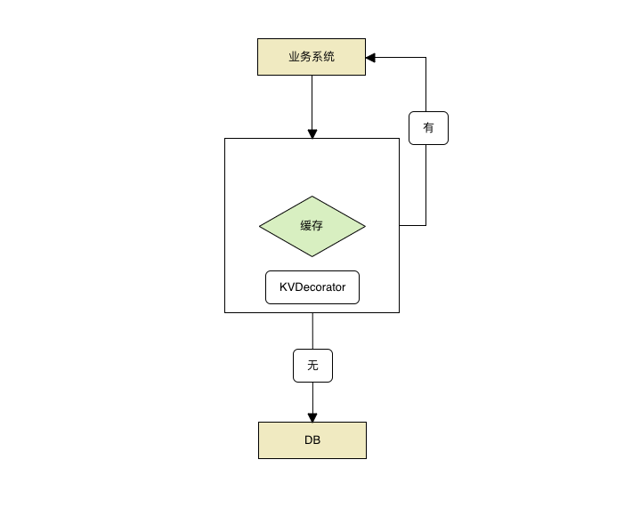

KVDecorator
===========

兜底缓存, 在分布式缓存挂了之后会自动切换为内存做缓存。



Installation
------------

Install KVDecorator using the "go get" command:

    go get github.com/FastSchnell/KVDecorator/kv


Usage
-----
```go
import "KVDecorator/kv"

func testKV() {
	KV.InitLocalKV()
	KV.Put("a", "b", time.Second)
	val, _ := KV.Get("a")
}

```


License
-------

KVDecorator is available under the [Apache License, Version 2.0](http://www.apache.org/licenses/LICENSE-2.0.html).
