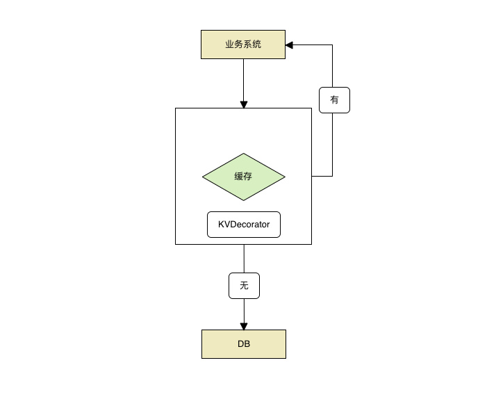

# KVDecorator

[](https://pkg.go.dev/github.com/FastSchnell/KVDecorator)
[](LICENSE)

A transparent fallback cache for [go-redis](https://github.com/redis/go-redis). When your Redis goes down, KVDecorator automatically routes supported commands to an in-memory cache — **zero code changes required** in your business logic.



## How It Works

```
Normal:    Client  ──▶  go-redis  ──▶  Redis     (+ dual-write to local cache)
Degraded:  Client  ──▶  go-redis  ──▶  LocalCache (circuit breaker open)
Recovery:  TCP probe detects Redis is back  ──▶  auto switch to remote
```

1. **TCP Circuit Breaker** — A background goroutine probes the Redis address via TCP dial at a configurable interval. After N consecutive failures, the breaker opens. No request-path latency is added.
2. **FallbackHook** — Implements `redis.Hook`. During normal operation, write commands (`SET`, `DEL`, `MSET`) are dual-written to a local in-memory cache. When the breaker opens, all supported commands are served from the local cache.
3. **LocalCache** — A `sync.RWMutex`-protected `map[string]Item` with lazy expiration on read and periodic background cleanup.

## Installation

```bash
go get github.com/FastSchnell/KVDecorator
```

Requires Go 1.21+ and go-redis v9.

## Quick Start

```go
package main

import (
	"context"
	"fmt"
	"time"

	"github.com/FastSchnell/KVDecorator"
	"github.com/redis/go-redis/v9"
)

func main() {
	rdb := redis.NewClient(&redis.Options{Addr: "localhost:6379"})

	hook := kvdecorator.NewFallbackHook("localhost:6379")
	defer hook.Close()
	rdb.AddHook(hook)

	ctx := context.Background()

	// Business code is unchanged — fallback is transparent
	rdb.Set(ctx, "user:1:name", "Alice", 10*time.Minute)
	val, err := rdb.Get(ctx, "user:1:name").Result()
	fmt.Println(val, err) // "Alice" <nil>  — from Redis or local cache
}
```

## Configuration

```go
hook := kvdecorator.NewFallbackHook("localhost:6379",
	kvdecorator.WithHookProbeInterval(2*time.Second),   // TCP probe interval (default: 1s)
	kvdecorator.WithHookDialTimeout(time.Second),        // TCP dial timeout  (default: 500ms)
	kvdecorator.WithHookThreshold(5),                    // consecutive failures to trip (default: 3)
	kvdecorator.WithHookCleanupInterval(30*time.Second), // expired-key cleanup interval (default: 10s)
)
```

| Option | Default | Description |
|--------|---------|-------------|
| `WithHookProbeInterval` | 1s | How often the background goroutine probes Redis via TCP |
| `WithHookDialTimeout` | 500ms | Timeout for each TCP probe dial |
| `WithHookThreshold` | 3 | Consecutive probe failures required to open the breaker |
| `WithHookCleanupInterval` | 10s | Interval for the background goroutine that purges expired keys |

## Supported Commands in Degraded Mode

| Command | Local Behavior |
|---------|---------------|
| `GET` | Returns cached value or `redis.Nil` |
| `SET` | Stores in local cache, supports `EX` / `PX` / `EXAT` / `PXAT` |
| `DEL` | Removes from local cache, returns delete count |
| `MGET` | Returns multiple cached values |
| `MSET` | Stores multiple key-value pairs |
| `EXISTS` | Returns count of existing keys |
| `EXPIRE` | Updates TTL on an existing key |
| `TTL` | Returns remaining TTL |
| `PING` | Returns `PONG` |

Unsupported commands (e.g. `LPUSH`, `ZADD`, `HSET`) return `kvdecorator.ErrDegraded`.

## Observability

```go
// Check breaker state programmatically
if hook.IsDown() {
	log.Warn("Redis is unreachable, serving from local cache")
}
```

## Design Decisions

- **TCP probe, not request-path detection** — The circuit breaker runs independently. It never adds latency to real commands, and it detects recovery even when there is no traffic.
- **Dual-write on success** — During normal operation, `SET`/`DEL`/`MSET` results are mirrored to the local cache. This ensures the local cache is warm when a failover happens.
- **`redis.Hook` integration** — No wrapper client, no custom interface. Just `AddHook()` on any existing `redis.Client`, `redis.ClusterClient`, or `redis.Ring`.
- **No external dependencies** — Only depends on `go-redis/v9` and the Go standard library.

## Testing

```bash
go test -race -v ./...
```

25 tests covering:
- LocalCache: set/get, TTL expiration, delete, exists, mget/mset, expire, flush, concurrent access
- CircuitBreaker: healthy server, dead server, recovery cycle
- FallbackHook: all supported commands, backup logic, degraded routing, pipeline handling

## License

KVDecorator is available under the [Apache License, Version 2.0](http://www.apache.org/licenses/LICENSE-2.0.html).
